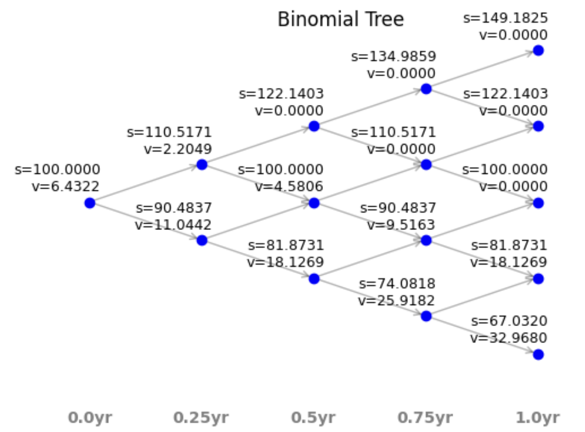
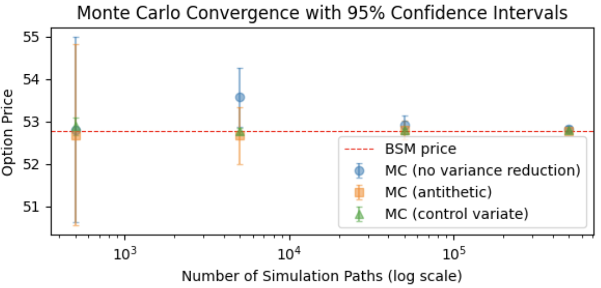
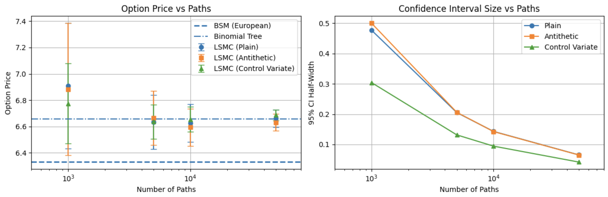
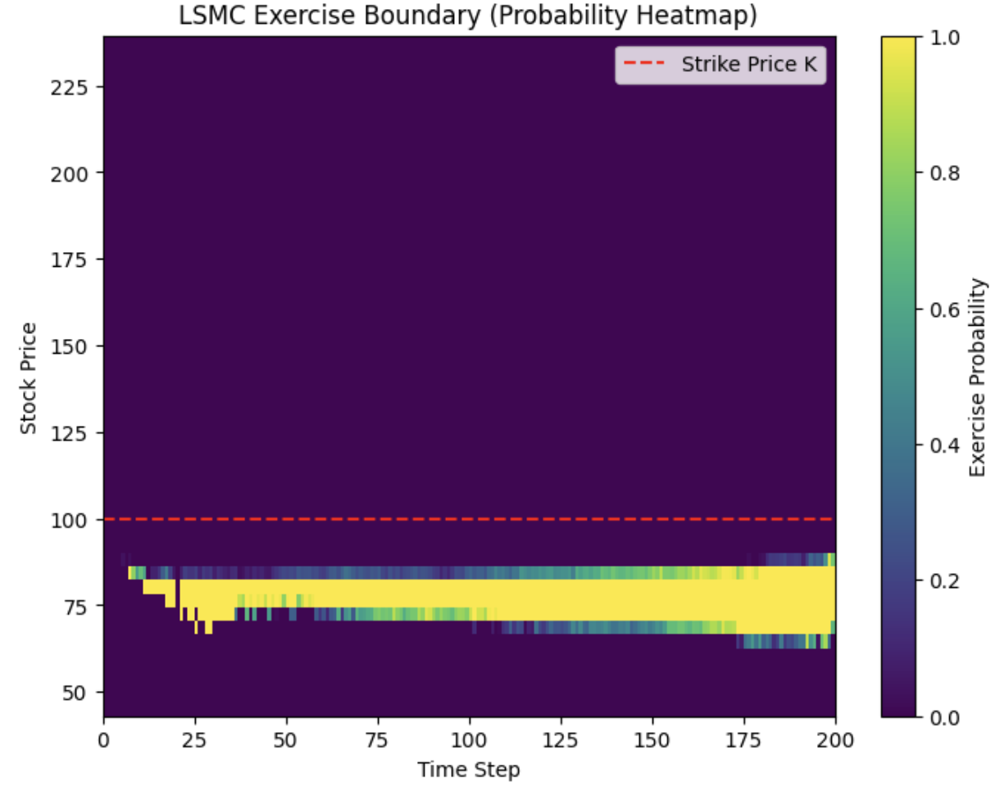

# Options, Futures, and Other Derivatives


Python implementations of foundational derivatives pricing models and risk tools, based on
[Options, Futures, and Other Derivatives](https://www-2.rotman.utoronto.ca/~hull/ofod/index.html) by John C. Hull.

All models are implemented from scratch for learning, transparency, and reproducibility.

---

## Visualizations

### Binomial Tree

Stock price and option value at each node for a 4-step tree. See [`notebooks/Binomial Trees.ipynb`](notebooks/Binomial%20Trees.ipynb) for details.

### Monte Carlo Convergence (European)

Convergence of European call price as a function of simulation paths, comparing plain MC, antithetic variates, and control variate. See [`notebooks/Monte Carlo Simulation.ipynb`](notebooks/Monte%20Carlo%20Simulation.ipynb) for details.

### LSMC Convergence (American)

Convergence of American put price under LSMC versus the binomial tree benchmark, across varying path counts and variance reduction methods. See [`notebooks/Monte Carlo Simulation.ipynb`](notebooks/Monte%20Carlo%20Simulation.ipynb) for details.

### LSMC Exercise Boundary

Heatmap of early exercise probability across time and stock price, with the estimated optimal exercise boundary overlaid. See [`notebooks/Monte Carlo Simulation.ipynb`](notebooks/Monte%20Carlo%20Simulation.ipynb) for details.

---

## Contents

| Module | Description |
|---|---|
| `src/black_scholes_merton.py` | BSM option pricing for European options |
| `src/binomial_model.py` | Binomial tree pricing for European and American options |
| `src/monte_carlo.py` | Monte Carlo simulation with variance reduction |
| `src/greeks.py` | Option Greeks via BSM formulas and binomial trees |
| `src/implied_vol.py` | Implied volatility via Newton-Raphson, Bisection, and Brent's method |
| `src/risk_metrics.py` | Value-at-Risk and Expected Shortfall |
| `src/visualization.py` | Binomial tree visualization |

---

## Quick Start

### Black-Scholes-Merton Pricing

```python
from src.black_scholes_merton import price_option_bsm

# Price a European call option
# S=100, K=100, r=5%, sigma=20%, T=1yr, q=0%
price = price_option_bsm(
    option_type='call',
    exercise_style='European',
    s=100, k=100, r=0.05, sigma=0.2, T=1.0, q=0.0
)
print(f"Call price: {price:.4f}")  # 10.4506
```

---

### Binomial Tree Pricing

```python
from src.binomial_model import price_option_tree

# Price a European call — should match BSM
price_eu = price_option_tree(
    option_type='call',
    exercise_style='European',
    s=100, k=100, r=0.05, sigma=0.2, T=1.0, N=500, q=0.0
)

# Price an American put — early exercise premium
price_am = price_option_tree(
    option_type='put',
    exercise_style='American',
    s=100, k=100, r=0.05, sigma=0.2, T=1.0, N=500, q=0.0
)

print(f"European call (tree): {price_eu:.4f}")
print(f"American put  (tree): {price_am:.4f}")
```

Retrieve the full tree for visualization:

```python
price, stocks, options, timeline = price_option_tree(
    option_type='call', exercise_style='European',
    s=100, k=100, r=0.05, sigma=0.2, T=1.0, N=4, q=0.0,
    return_tree=True
)

from src.visualization import plot_binomial_trees
plot_binomial_trees(stocks, options, timeline)
```

---

### Monte Carlo Simulation

#### European Options

```python
from src.monte_carlo import price_option_mc

# Plain Monte Carlo
price, std_err = price_option_mc(
    option_type='call', exercise_style='European',
    s=100, k=100, r=0.05, sigma=0.2, T=1.0, q=0.0,
    n_paths=10000, seed=42
)
print(f"MC price: {price:.4f} ± {std_err:.4f}")

# With antithetic variates (variance reduction)
price_av, std_err_av = price_option_mc(
    option_type='call', exercise_style='European',
    s=100, k=100, r=0.05, sigma=0.2, T=1.0, q=0.0,
    n_paths=10000, antithetic=True, seed=42
)
print(f"MC price (antithetic): {price_av:.4f} ± {std_err_av:.4f}")

# With control variate (further variance reduction)
price_cv, std_err_cv = price_option_mc(
    option_type='call', exercise_style='European',
    s=100, k=100, r=0.05, sigma=0.2, T=1.0, q=0.0,
    n_paths=10000, control_variate=True, seed=42
)
print(f"MC price (control variate): {price_cv:.4f} ± {std_err_cv:.4f}")
```

#### American Options — Longstaff-Schwartz (LSMC)

The Longstaff-Schwartz algorithm prices American options via Monte Carlo by estimating the
continuation value at each time step using least-squares regression. At each step, the
algorithm compares the early exercise payoff against the fitted continuation value and
exercises optimally. The option price is the average discounted payoff across all paths.

```python
from src.monte_carlo import price_option_lsmc

# Standard LSMC for an American put
price_lsmc = price_option_lsmc(
    option_type='put',
    s=100, k=100, r=0.05, sigma=0.2, T=1.0, q=0.0,
    n_paths=10000, n_steps=500, seed=42
)
print(f"American put (LSMC): {price_lsmc:.4f}")

# LSMC with antithetic variates
price_av = price_option_lsmc(
    option_type='put',
    s=100, k=100, r=0.05, sigma=0.2, T=1.0, q=0.0,
    n_paths=10000, n_steps=500, antithetic=True, seed=42
)
print(f"American put (LSMC + antithetic): {price_av:.4f}")

# LSMC with higher-order polynomial regression
price_poly = price_option_lsmc(
    option_type='put',
    s=100, k=100, r=0.05, sigma=0.2, T=1.0, q=0.0,
    n_paths=10000, n_steps=500, poly_degree=3, seed=42
)
print(f"American put (LSMC, degree-3): {price_poly:.4f}")

# LSMC with ridge-regularized regression
price_ridge = price_option_lsmc(
    option_type='put',
    s=100, k=100, r=0.05, sigma=0.2, T=1.0, q=0.0,
    n_paths=10000, n_steps=500, ridge=True, seed=42
)
print(f"American put (LSMC + ridge): {price_ridge:.4f}")
```

---

### Option Greeks

Greeks are available via both BSM closed-form formulas and finite-difference binomial tree methods.

```python
from src.greeks import delta_bsm, gamma_bsm, vega_bsm, theta_bsm, rho_bsm
from src.greeks import delta_tree, gamma_tree, vega_tree, theta_tree, rho_tree

s, k, r, sigma, T, q = 100, 100, 0.05, 0.2, 1.0, 0.0

# BSM Greeks
print(f"Delta : {delta_bsm('call', s, k, r, sigma, T, q):.4f}")
print(f"Gamma : {gamma_bsm(s, k, r, sigma, T, q):.4f}")
print(f"Vega  : {vega_bsm(s, k, r, sigma, T, q):.4f}")
print(f"Theta : {theta_bsm('call', s, k, r, sigma, T, q):.4f}")
print(f"Rho   : {rho_bsm('call', s, k, r, sigma, T, q):.4f}")

# Binomial tree Greeks (also supports American options)
print(f"Delta (tree): {delta_tree('call', 'European', s, k, sigma, T, N=500, r=r, q=q):.4f}")
print(f"Gamma (tree): {gamma_tree('call', 'European', s, k, sigma, T, N=500, r=r, q=q):.4f}")
```

---

### Implied Volatility

Three methods are implemented: Newton-Raphson, Bisection, and Brent's method.
Brent's method also supports American options via the binomial tree.

```python
from src.implied_vol import implied_vol_brent, implied_vol_newton, implied_vol_bisect

market_price = 10.45  # observed market price

# Brent's method — recommended (European or American)
iv = implied_vol_brent(
    option_type='call', exercise_style='European',
    price=market_price, s=100, k=100, r=0.05, T=1.0, q=0.0
)
print(f"Implied vol (Brent): {iv:.4f}")

# Newton-Raphson (European only; falls back to Bisection if it doesn't converge)
iv_nr = implied_vol_newton(
    option_type='call', exercise_style='European',
    price=market_price, s=100, k=100, r=0.05, T=1.0, q=0.0
)
print(f"Implied vol (Newton): {iv_nr:.4f}")

# American put implied vol via Brent + binomial tree
iv_am = implied_vol_brent(
    option_type='put', exercise_style='American',
    price=5.0, s=100, k=100, r=0.05, T=1.0, q=0.0, N=200
)
print(f"Implied vol (American put, Brent): {iv_am:.4f}")
```

---

### Value-at-Risk and Expected Shortfall

```python
import numpy as np
from src.risk_metrics import historical_var, historical_es

# Simulate daily log-returns
np.random.seed(42)
returns = np.random.normal(0, 0.01, 1000)

# 95% VaR and ES (x=0.05 means 5th percentile)
var_95 = historical_var(returns, x=0.05)
es_95  = historical_es(returns, x=0.05)

print(f"95% VaR: {var_95:.4f}")
print(f"95% ES : {es_95:.4f}")
```

---

## Notebooks

Interactive notebooks with worked examples and visualizations:

| Notebook | Topics Covered |
|---|---|
| `notebooks/Binomial Trees.ipynb` | Tree construction, European & American pricing, visualization |
| `notebooks/Monte Carlo Simulation.ipynb` | Plain MC, antithetic variates, control variate, convergence; LSMC for American options, variance reduction, polynomial & ridge extensions, exercise boundary heatmap |
| `notebooks/demo of greeks.ipynb` | BSM vs. tree Greeks, sensitivity profiles |
| `notebooks/implied volatility.ipynb` | Newton-Raphson, Bisection, Brent's method |
| `notebooks/Value at Risk and Expected Shortfall.ipynb` | Historical simulation, parametric methods |

---

## Reference

- Hull, J. C. (2022). *Options, Futures, and Other Derivatives* (11th ed.). Pearson.
- Longstaff, F. A., & Schwartz, E. S. (2001). Valuing American options by simulation: A simple least-squares approach. *Review of Financial Studies*, 14(1), 113–147.
- ChatGPT and Claude were used to assist with code optimization and documentation.

---

## Author

- **Hsiu-Hsien (Leo) Lin**
- [hhlin.work@gmail.com](mailto:hhlin.work@gmail.com)
- [GitHub](https://github.com/hsiuhsil)
- [LinkedIn](https://www.linkedin.com/in/hsiuhsil/)

